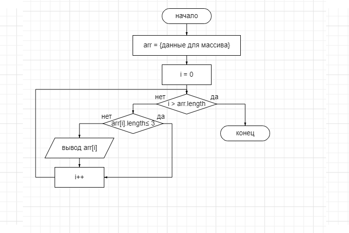

# Задача
Написать программу, которая из имеющегося массива строк формирует массив из строк, длина которых меньше либо равна 3 символам.
# Решение на блок-схеме

# Описание решения
 1. Получаем массив строк arr
 2. Добавляем переменную i
 3. Сравниваем значение i и длину массива
 4. Если i меньше длины массива делаем следующие команды

    4.1. Если длина значения arr[i] меньше либо равна 3, то выводим её на экран/добавляем в новый массив
 
    4.2. Увеличиваем значение i на 1

    4.3. Возвращаемся к 3 пункту

 5. Если i равна длине массива, то программа завершается/выводится полученный массив.
